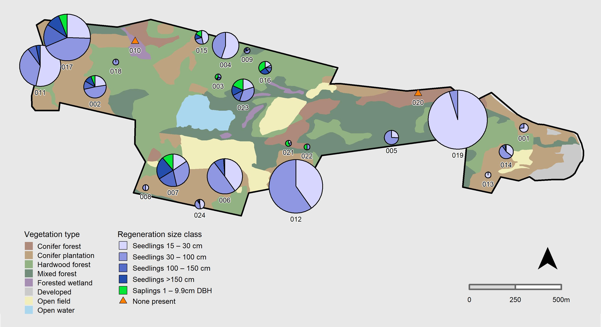

<style>
@media print {

  font[color="white"] {
    color: "black"!important;
    -webkit-print-color-adjust:exact;
  }

}
</style>
```{r setup, include=FALSE}
knitr::opts_chunk$set(echo = TRUE)
```

<h1 class = "title"> Map 1. Tree Regeneration by Size Class </h1>
<p class = "boxBorder">Tree regeneration stem densities by size class in forest plots from the most recent survey cycle (2016 – 2019). Each plot is sampled on a 4-year cycle in a rotating panel, with one quarter of the plots sampled every year. Pie size is proportional to plot-level regeneration density. Pies may be shifted to prevent overlap. Densities range from 0 to 3.4 stem/sq.m for an individual size class and only include native canopy-forming species. Seedlings are individuals ≥ 15 cm tall and < 1 cm diameter at breast height (DBH). Saplings are individuals ≥ 1 cm and < 10 cm DBH. Reporting Date: `r format(Sys.time(), "%m/%d/%Y")`</p>


